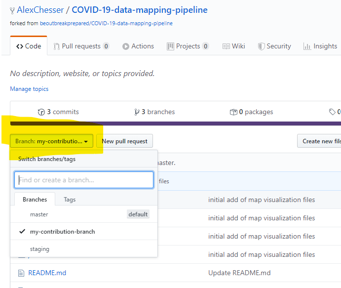
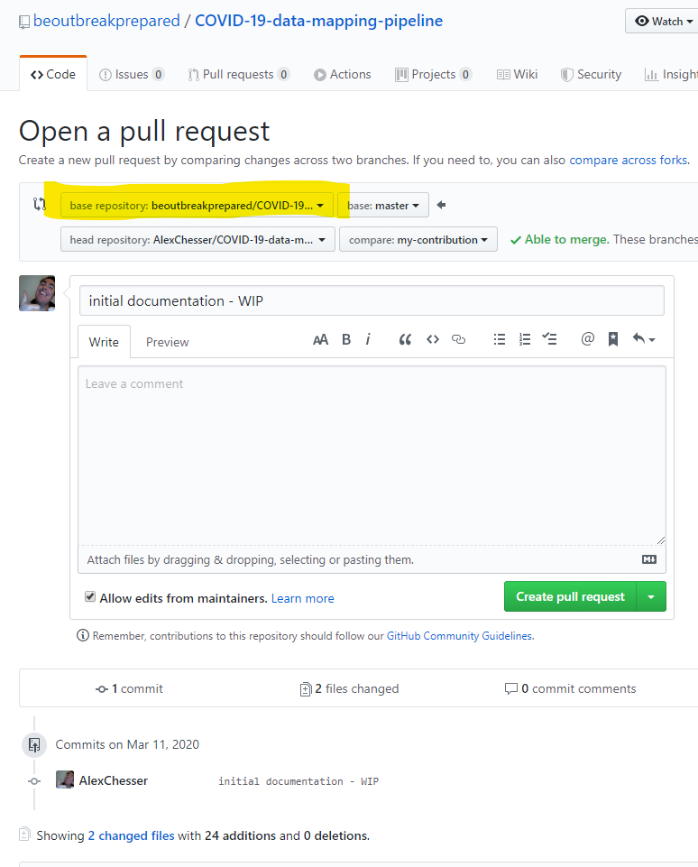
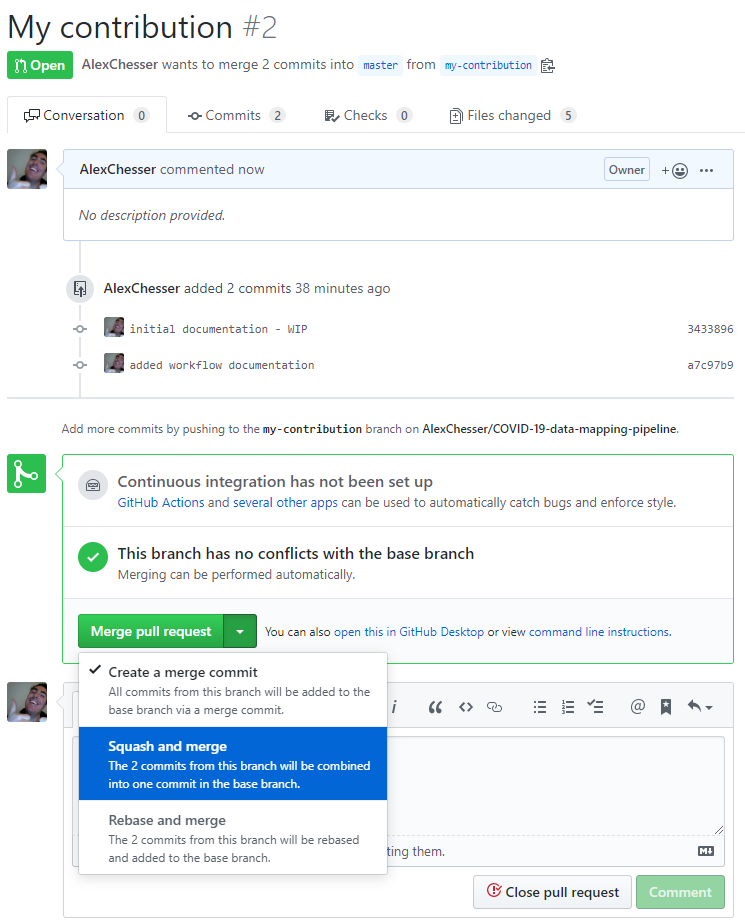
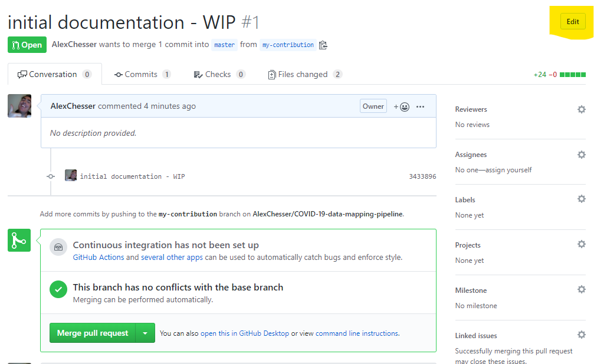

testing 
# COVID-19 data and mappin pipeline
Resource hub for code related to data processing and mapping piepline

# Contributions

The workflow for contributing to this project is a pull request based workflow. If you are unfamilliar with pull requests you can read more about it here: https://help.github.com/en/github/collaborating-with-issues-and-pull-requests/about-pull-requests

Steps to the pull request workflow:

* Fork the [beoutbreakprepared/COVID-19-data-mapping-pipeline](https://github.com/beoutbreakprepared/COVID-19-data-mapping-pipeline/) repo and create a branch for your changes.
* Submit a Pull Request to `master` with your changes.
* you may be asked to rebase & squash all commits related to a topic into a single commit.
* project administrators may change the incoming branch for complex submissions so they can be tested first 

## Submitting a pull request (PR) via github

When you have a contribution in your forked repository you can select the branch in the github interface.

After you have selected the branch, click the `New pull request` button beside it. You will see the pull request (PR) interface.

The **base repository** will the the `beoutbreakprepared/COVID-19-data-mapping-pipeline`. This will sometimes be referred to as "upstream" in git parlance. 
The **base** represents the branch which will receive the code updates.
The **head repository** will represent yours. 
The **compare** dropdown represents the code you are planning on sending back to the project.

If you scroll down the rest of the page at this point you should see a series of file diffs. Consider this one last good chance to double check tha the work you are sending back to the project is clean and that you are happy with it. Keep an eye out for these common issues:

* did your text editor or IDE change line endings or formatting for an entire document? This can make it difficult for the reviewer to review your code.
* did any automatic or operating system files get added? 
* are you only commiting the things that you deliberately intended to change?

In cases of working on larger teams it can be helpful to take a moment of reflection before clicking the `Create pull Request` button. 

## Squashing all commits into one

If you followed the process of branching your own work off of master, squashing your commits into a single topic before sending a PR is easy in github's online interface (it is a lot harder on the command line). 

* push your working branch into your own repo
* open a pull request into your own MASTER branch
* select "SQUASH AND MERGE" in your pull request

After you have done a Squash and Merge, you can send your Pull Request back upstream from your own `master` branch instead of your working branch.

## Accepting a pull request

When accepting a pull request, in simple cases it can be as easy as clicking the `Merge Pull Request` button. 

In cases where complex code is being introduced, it can be helpful to edit the incoming branch.

The branch selection dropdown will allow an administrator to select a branch to allow further testing before deployment.

